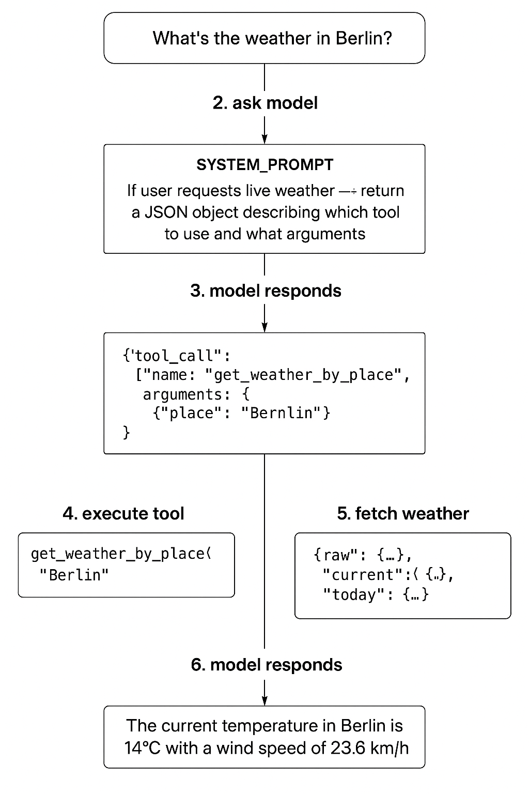

Below is a **complete, clear, non-technical explanation** of how your **Weather AI Agent** works — from the user typing a question → to the AI → to the weather API → back to the user.

No code.
Just concepts.
Very simple.

---

# 🌤️ **WHAT YOU ARE BUILDING**

You are building **an app where the user speaks human language**, like:

> “What’s the weather in Berlin right now?”
> “Will it rain today?”
> “How windy is it in Belgrade this afternoon?”

Your system must:

1. **Understand the question**
2. **Turn it into a real weather API call**
3. **Fetch the weather from Open-Meteo**
4. **Convert the raw weather data into a clean, human response**
5. **Send the answer back**

The AI is not generating the weather.
It is generating **an API call**.

---

# 🧠 **KEY PIECES OF THE SYSTEM**

Your weather agent has **three major components**:

---

## **1. The AI Model (LLM)**

This is the brain.

- Takes the user’s message
- Understands meaning: location, time, weather type
- Translates that meaning into a **structured weather request**
  (e.g., latitude, longitude, what data to fetch)

Think of the LLM as:

> “If the user asks for weather in Berlin, I should produce parameters like:
> latitude=52.52, longitude=13.41, and they asked for temperature.”

---

## **2. The Agent Logic (Your middleware)**

This is the **manager** sitting between the AI and your backend.

It does three jobs:

### **A. Receive AI instructions**

The AI outputs something like:

- `"city": "Berlin"`
- `"lat": 52.52`
- `"lon": 13.41`
- `"needs": ["current_temperature", "wind"]`

### **B. Convert it into API parameters**

Open-Meteo requires specific fields like:

- latitude
- longitude
- which weather variables you want
- hourly or current

The agent knows how to map AI intent → API query.

### **C. Call your backend weather service**

The agent doesn't call the weather API directly.
It instructs your backend:

> “Fetch temperature and wind for this location.”

---

## **3. The Weather API (Open-Meteo)**

This gives real, live weather data.

Your backend sends a real HTTP call, like:

```
https://api.open-meteo.com/v1/forecast
    ?latitude=52.52
    &longitude=13.41
    &current=temperature_2m,wind_speed_10m
    &hourly=temperature_2m,wind_speed_10m
```

Open-Meteo responds with raw meteorological data:

- current temperature
- hourly temperatures
- humidity
- wind speed

But it’s raw mathematical data — not ready for a human.

---

# 🧰 **HOW THE PARTS WORK TOGETHER (STEP-BY-STEP)**

Let’s describe the entire flow:

---

# **STEP 1: User asks a question**

Example:

> “What’s the weather like today in Berlin?”

---

# **STEP 2: The AI model interprets the question**

It figures out:

- user wants **current** and **today’s** weather
- location = Berlin
- needs temperature + wind + general conditions

This is called **intent extraction**.

---

# **STEP 3: The agent converts the AI output into API parameters**

The agent looks at what the AI said and forms something like:

- lat: 52.52
- lon: 13.41
- ask for:

  - current temperature
  - current wind
  - hourly forecast

These get inserted into a weather API request.

---

# **STEP 4: The backend calls Open-Meteo**

Your server sends a real HTTP request to:

> _[https://api.open-meteo.com/v1/forecast](https://api.open-meteo.com/v1/forecast)_

The server receives a JSON body with dozens of fields.

---

# **STEP 5: Your weather “parser” builds something meaningful**

The raw JSON contains:

- long lists of data
- timestamps
- indices
- arrays that must be matched
- humidity, wind, temperature split into parallel lists

Your WeatherResponse class (no code now) reorganizes it:

- pairs times with temperatures
- simplifies the data
- extracts “today’s minimum temperature”, etc.
- prepares a human-readable structure

---

# **STEP 6: The AI writes the final answer to the user**

Now the LLM uses:

- the structured weather data
- the original question

to generate a natural-language answer:

> “Right now in Berlin it’s 4.6°C with light wind.
> Today’s temperature will range from 0.5°C to 5.3°C.”

The AI is not inventing the numbers —
it is reading them from the API response.

---

# 🌟 **Concept Summary**

| Concept                   | Meaning                                                |
| ------------------------- | ------------------------------------------------------ |
| **Prompt**                | What the user types (“Weather in Berlin?”).            |
| **LLM**                   | The AI brain that interprets the prompt.               |
| **Agent**                 | The logic layer that converts AI intent → API calls.   |
| **Backend service**       | Your server that actually talks to Open-Meteo.         |
| **WeatherResponse class** | A transformer that turns raw API data → readable data. |
| **Final AI response**     | Natural language summary written by the AI.            |

---

# ⭐ THE BIG IDEA

Your AI agent is not “smart” on its own.

The intelligence comes from:

- the LLM understanding questions
- your agent structuring the response
- your backend fetching real data
- your response parser making it clean
- the LLM writing the final answer

It is a **chain of responsibility**, each part doing one job very well.

---

Absolutely — here is a **full, clean, beginner-friendly explanation of the entire weather tool system**, from top to bottom, so you finally understand it fully and clearly.

---

# ✅ **THE BIG PICTURE**

You are building a **chat endpoint** where the AI (Gemini) can:

1. **Talk normally**, like a regular chatbot
2. **OR request live weather data** using a “tool”

A **tool** is simply a **Python function** (in your backend) that the AI can ask you to run.

The AI **cannot call the internet itself**, so tools allow it to say:

> “I need live weather → please call this function for me.”

You detect that, run the tool, send the result back to the AI, and then the AI writes a final answer.

---

# 🎯 **THE FULL FLOW (VERY IMPORTANT)**

Here is the exact chain of actions for a weather request:

---

## **1️⃣ User says something**

Example:

> "What's the weather in Berlin?"

---

## **2️⃣ You send messages to Gemini**

```python
messages = [
    {"role": "system", "content": SYSTEM_PROMPT},
    ...conversation history...
    {"role": "user", "content": "What's the weather in Berlin?"}
]
```

---

## **3️⃣ Gemini reads the SYSTEM_PROMPT**

Your SYSTEM_PROMPT says:

> "If the user wants live weather → return a JSON object describing WHICH tool to use and WHAT arguments."

So Gemini returns something like:

```json
{
  "tool_call": {
    "name": "get_weather_by_place",
    "arguments": { "place": "Berlin" }
  }
}
```

No text.
Only JSON.

---

## **4️⃣ Your backend reads that JSON**

```python
tool = payload["tool_call"]
name = tool["name"]
args = tool["arguments"]
```

You check:

- If tool is `get_weather_by_place` → call `get_weather_by_place()`
- If tool is `get_weather_by_coords` → call `get_weather_by_coords()`

---

## **5️⃣ Backend executes the “tool”**

This is your code:

### **get_weather_by_place()**

```python
coords = await weather_service.geocode(place)
return await get_weather_by_coords(coords["lat"], coords["lon"])
```

This means:

**(A) Convert "Berlin" → latitude/longitude using Nominatim**
**(B) Then fetch live weather using Open-Meteo**

---

## **6️⃣ WeatherServiceChatGPT makes API requests**

### 🌍 Geocoding API

```
NOMINATIM_BASE = "https://nominatim.openstreetmap.org/search"
```

Used to convert "Berlin" → coordinates.

### 🌤 Weather API

```
OPEN_METEO_BASE = "https://api.open-meteo.com/v1/forecast"
```

Used to get temperature, humidity, wind, etc.

These constants are just URLs.
They avoid repeating long strings.

---

## **7️⃣ Tool returns weather data**

Your `get_weather_by_coords()` returns:

```json
{
  "raw": {...},
  "current": {...},
  "today": {...},
  "hourly_sample": [...]
}
```

---

## **8️⃣ Your backend sends this back to Gemini**

```python
messages.append({
  "role": "tool",
  "content": json.dumps({"name": name, "result": tool_result})
})
```

Now Gemini knows:

- The tool was executed
- What the weather is

---

## **9️⃣ Gemini generates the final user-friendly answer**

Example:

> "Current temperature in Berlin is 14°C, with wind 23 km/h..."

This is what the user finally sees.

---

# 🎉 **NOW THE KEY PARTS (EXPLAINED SIMPLY)**

---

# 🔹 **SYSTEM_PROMPT**

It tells Gemini:

- When to call a tool
- How to format the JSON
- When to reply normally

It enforces the tool-calling behavior.

---

# 🔹 **extract_json()**

Gemini might wrap the JSON inside:

````
```json
{
  ...
}
````

This function removes the code fences.

---

# 🔹 **process_chat()**

This is the **brain** of your entire weather tool logic.

Steps inside:

### ✔️ Build messages

(system, history, user)

### ✔️ Get initial AI response

This may be:

- normal text
- JSON for tool call

### ✔️ Try to parse JSON

If JSON exists → call tool
If not → return AI text directly

### ✔️ After executing tool

Send the result back as a **tool message**

### ✔️ Ask Gemini for final answer

---

# 🔹 **WeatherServiceChatGPT**

This is just a helper class that makes external HTTP requests:

1. Geocoding (city → coords)
2. Weather (coords → forecast)

---

# 🧭 **What Are “Tools” in Your Project?**

They are just Python functions:

```python
async def get_weather_by_place(...)
async def get_weather_by_coords(...)
```

Your AI can't call APIs.
But **your API can**, using these functions.

Tools allow the AI to _ask_ your backend to run them.

---

# 🧠 **You Now Understand:**

### ✔️ What tools are

### ✔️ Why SYSTEM_PROMPT exists

### ✔️ Why we parse JSON

### ✔️ Why OPEN_METEO_BASE and NOMINATIM_BASE exist

### ✔️ How the backend fetches real weather

### ✔️ How the AI knows when to ask for live weather

### ✔️ Why the AI returns JSON on first response

### ✔️ How your backend completes the loop

---


